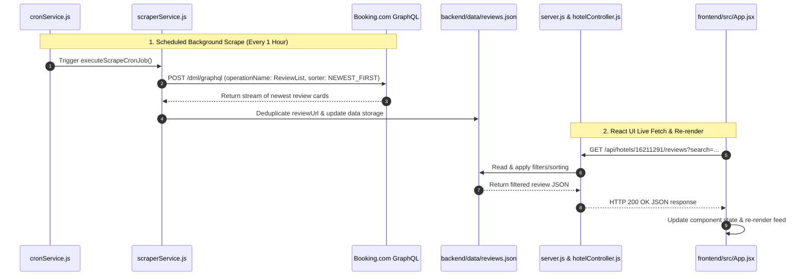

# Booking.com Review Scraper & Analytics Dashboard 🏨

An end-to-end, high-performance Booking.com hotel review scraper and analytics portal built with **Node.js, Express, Playwright, React, Vite, and Node-Cron**.

---

## 🌟 Key Features

- **GraphQL API Scraper Engine**: Reverse-engineered Booking.com's internal `ReviewList` GraphQL endpoint (`POST https://www.booking.com/dml/graphql?lang=en-us`).
- **Incremental Deduplication & Fast Early-Exit**: Sorts by `NEWEST_FIRST` and compares unique `reviewUrl` IDs against database records to terminate early, minimizing request volume and bypassing AWS WAF rate limits.
- **Node-Cron Background Scheduler**: Runs automated background sync jobs every 1 hour (`0 * * * *`).
- **Decoupled Architecture**: Separate modular **`backend/`** (Express REST API) and **`frontend/`** (React UI).
- **Interactive React Portal**: Sleek dark-mode dashboard with instant keyword search, score filtering (`9+ Superb`, `7-9 Good`, `5-7 Fair`, `<5 Poor`), dynamic sorting, category rating bars, and hotel reply rendering.

---

## 🗺️ How the System Works: File-by-File Execution Flow



---

### 📁 File-by-File Technical Breakdown

#### 1️⃣ `backend/services/cronService.js` (Scheduler & Background Runner)
- **Role**: Registers background scheduled jobs using `node-cron`.
- **Logic**: Executes every 1 hour (`0 * * * *`). Calls `executeScrapeCronJob()` which initiates the incremental scraper, updates cron status metrics (`totalRuns`, `lastRunAt`), and records completion status.

#### 2️⃣ `backend/services/scraperService.js` (GraphQL Engine & Early-Exit Deduplication)
- **Role**: Playwright browser context runner for network interaction.
- **Logic**: Posts GraphQL requests with `operationName: "ReviewList"` and `sorter: "NEWEST_FIRST"`. For each incoming review:
  - Extracts the unique `reviewUrl` ID (e.g. `"035ee4ae91790134"`).
  - Checks if the ID exists in storage.
  - **If Existing**: Exits early (stops further page queries), saving network calls and avoiding WAF triggers.
  - **If New**: Formats review attributes and appends to storage.

#### 3️⃣ `backend/data/reviews.json` (Data Storage Layer)
- **Role**: Persistent JSON database layer.
- **Structure**: Stores property metadata (`name`, `overallScore`, category sub-ratings) and review arrays (`id`, `score`, `text`, `reviewer`, `stayDetails`, `hotelReply`).

#### 4️⃣ `backend/controllers/hotelController.js` & `backend/routes/hotelRoutes.js` (API Processing Layer)
- **Role**: Serves REST endpoints for the frontend.
- **Logic**: Exposes `GET /api/hotels/:id/reviews`. Reads storage and performs server-side filtering:
  - **Search**: Case-insensitive keyword matching across reviewer name, country, room type, title, positive text, and negative text.
  - **Score Filter**: Filters by score tier (`SUPERB`, `GOOD`, `FAIR`, `POOR`).
  - **Sorting**: Orders records by date (`NEWEST`) or score (`HIGHEST` / `LOWEST`).

#### 5️⃣ `backend/controllers/cronController.js` & `backend/routes/cronRoutes.js` (Cron Management API)
- **Role**: Exposes `/api/cron/status` and `/api/cron/trigger`.
- **Logic**: Allows the frontend dashboard to display active schedule status and trigger manual on-demand syncs.

#### 6️⃣ `backend/server.js` (Express Server Entry Point)
- **Role**: Main server configuration.
- **Logic**: Initializes `cors` and JSON parsers, mounts API routes, starts Express on port `5000`, and initializes `initCronJobs()`.

#### 7️⃣ `frontend/src/App.jsx` (React Dashboard Component)
- **Role**: Main React UI.
- **Logic**: Calls `fetchReviews()` via `useEffect()` on state change. Passes parameters to Express API (`/api/hotels/16211291/reviews?search=...`), receives updated JSON, and triggers state updates (`setReviews`, `setHotelData`), rendering updated review cards dynamically.

#### 8️⃣ `frontend/src/index.css` (Design System)
- **Role**: Styling engine.
- **Logic**: Defines dark-mode theme CSS variables, pill badges, positive/negative sentiment callouts, and rating progress bars.

---

## 📂 Project Structure

```text
hotel-task/
├── README.md                      <-- Project documentation
├── .gitignore                     <-- Root gitignore
│
├── backend/                       <-- Express API & Cron Scheduler
│   ├── server.js                  <-- Express entry point (Port 5000)
│   ├── controllers/               <-- Request handlers (hotel, scrape, cron)
│   ├── routes/                    <-- API routes (/api/hotels, /api/scrape, /api/cron)
│   ├── services/                  <-- Node-Cron scheduler & Playwright scraper
│   └── data/
│       └── reviews.json           <-- Data storage layer
│
└── frontend/                      <-- React + Vite Dashboard
    ├── vite.config.js             <-- Vite config (Port 3000 / 3001)
    ├── index.html                 <-- HTML entry point
    └── src/
        ├── App.jsx                <-- React Dashboard component
        ├── main.jsx               <-- React DOM renderer
        └── index.css              <-- CSS Design System
```

---

## 🚀 Quick Start Guide

### 1. Backend Setup (Express API)

```bash
cd backend
npm install
npm run dev
```
> **Backend URL**: `http://localhost:5000`

---

### 2. Frontend Setup (React Dashboard)

```bash
cd frontend
npm install
npm run dev
```
> **Frontend URL**: `http://localhost:3000` (or `http://localhost:3001`)

---

## 🔌 REST API Endpoints

| Method | Endpoint | Description |
| :--- | :--- | :--- |
| `GET` | `/api/health` | Health check endpoint |
| `GET` | `/api/hotels` | List all tracked hotel properties |
| `GET` | `/api/hotels/:id/reviews` | Retrieve paginated/filtered reviews (`?search=`, `?score=`, `?sort=`) |
| `POST` | `/api/scrape` | Trigger live Playwright scraper for a property URL |
| `GET` | `/api/cron/status` | Get auto-sync cron scheduler status & metrics |
| `POST` | `/api/cron/trigger` | Manually trigger background cron sync on-demand |
